# **"DataGO" Proyecto Data Lovers**
## **Índice**

- Preámbulo
- Definición de usuario
    - Encuestas
    - Usuario (User persona)
    - Historias de Usuario
- Definición del producto
    - Experiencia
    - Planificación
    - Mapa de flujo
    - Wireframes (Prototipo de baja Fidelidad)
- Desarrollo de Interfaz UI, Testeos de Usuario e Iteraciones
    - Diseño UI-1
    - Diseño UI-2
    - Diseño UI-3
       - Testeos de Usuario UI-3
    - Diseño UI-4
       - Testeos de Usuario UI-4
    - Diseño UI-5
       - Testeos de Usuario UI-5
       - Evaluación Heurística
    - Cambios a aplicar en próxima interación
   ----------------------------------- 
"DataGO" [EXTRA] Proyecto Data Lovers
- Definición de usuario
  - Encuestas
  - Usuario (User persona)
  - Historias de Usuario y Definition of Done
- Iteración del producto
  - Mapa de flujo
  - Referente
  - Prototipo de baja Fidelidad
  - Prototipo de mediana Fidelidad
- Desarrollo de Interfaz UI
  - Mobile First
  - Flujo de Usabilidad
  - Evaluación Heurística
  - Prototipo de escritorio
      
-----------------------------

## **Preámbulo**

  "DataGO", es una plataforma tipo enciclopedia, donde puedes ver los datos de los Pokémon de la región de KANTO, como las debilidades y resistencias de su tipo frente a otros.

¡Una información realmente útil para jugadores que busquen participar en batallas!.  

## **Definición del Usuario**
-----------------------------
## **Encuestas**

Se realizó una encuesta, que fue compartida a través de distintos grupos de PokémonGo en las redes sociales, recibiendo 52 respuestas.

> Formulario hecho en [Google Forms](https://goo.gl/forms/E3LtaNA081hiwNRx2).

Gráficas de resultado de las respuestas.

> Puedes ver estas imágenes en mejor resolución en el siguiente [Álbum](https://photos.app.goo.gl/oWmf5sVBFa7v4ZuU9).

-----------------------------

## **Usuario (User persona)**

Creamos el siguiente prototipo de usuario jugador de "Pókemon GO" para indentificar sus necesidades.

- Nombre:  **Raúl Higueras**
- Trabajo:  **Diseñador**
- Localización:  **Santiago**
- Tipo de Jugador:  **Regular**
-----------------------------

### **Bio**
Raúl juega pokemon desde niño. Ahora que Pokemón GO salió al mercado, no dudó en sumarse a los millones de jugadores. Le gusta juntarse con amigos los fines de semana, jugar y pelear en gimnasios, y siempre busca las mejores estrategias para subir rápidamente de nivel. Pero siempre tiene problemas al momento de elegir su Pokemón para las batallas, ya que  no conoce todas las debilidades de sus contrincantes ni contra quienes sus pokemones pueden tener ventaja.

-----------------------------

### **Frustraciones**

- La gran cantidad de pokemones no le permite conocer de memoria todos las habilidades y debilidades de estos.
- No logra generar buenas estrategias.
Suele no elegir el pokemon adecuado al momento de combatir en gimnasios.
- Pierde las batallas, por lo que pierde las recompensas del juego y su tiempo.
- No logra subir rápido de nivel.
-----------------------------
### **Objetivos**

- Elegir el tipo de pokemon adecuado para las batallas.
- Ganar las batallas y las recompensas respectivas.
Subir de nivel.
-----------------------------

### **Necesidades**

- Tener información sobre el tipo de pokemones y sus debilidades.
- Saber contra que pokemones, su pokemon tiene ventaja y desventaja.
- Muestra visual de cada pokemon para identificarlos.
- Saber rápidamente las carácterísticas de un pokemon que conoce por nombre.

-----------------------------

### **Prototipo "User Persona"**

> Para ver en mejor resolución el prototipo de "User Persona", sigue [este enlace](https://photos.app.goo.gl/KLTsRB7FJcak3nnKA).

## **Historias de Usuario**
Una vez entendimos nuestra persona, definimos las siguientes historias de usuario como apoyo para el desarrollo de nuestro mapa de flujo y planificación.

|            COMO   |QUIERO                         |PARA                         |
|----------------|-------------------------------|-----------------------------|
|Jugador regular de Pokémon |`Conocer detalles de mis Pokémon`         |Generar buenas estrategias de combate            |
|Jugador regular de Pokémon          |`Realizar una búsqueda simple`          |Encontrar el Pokémon con sus características            |
|Jugador regular de Pokémon           |`Generar buenas estrategias de combate`|Ganar batallas y monedas|
|Jugador regular de Pokémon           |`Conocer las horas de aparición de los Pokémon`|Atrapar los Pokémon que deseo coleccionar|
|Jugador regular de Pokémon           |`Conocer que Pokémon provienen de cada huevo`|Eclosionar los Pokémon que busco|
|Jugador regular de Pokémon           |`Buscar Pokémon por tipo`|Encontrar más fácil el que busco|
|Jugador regular de Pokémon           |`Ver detalles de cada Pokémon`|Conocer bien cada uno de mis Pokémon|

# **Definición del Producto**

## **Experiencia**
 
"DataGO" es una Aplicación similar a la Pokédex, que muestra información detallada de cada Pokémon (de la región de Kanto, primera generación), como sus debilidades, resistencias, tipo de Huevo del que eclosiona, etc. 
Está pensada para jugadores regulares, que no manejan estos datos y que buscan mejorar en el juego y subir de nivel. La información que adquieran en la aplicación les permitirá saber que tipo de Pokémon elegir para combatir entre amigos y en gimnasios, que tipo de huevos necesitan encubar si buscan un Pokémon "x", a que hora hay más probabilidades de atrapar los Pokémon que busca, entre otros.

## Requerimientos de la aplicación:
- La información debe ser de fácil acceso
- Entregar información de forma rápida
- Debe mostrar información detallada
- Debe permitir buscar de forma simple
- Debe permitir buscar Pokémon sin saber bien los nombres
- Debe permitir buscar por tipo
- Debe permitir ordenar por nombre o número

-------------------
## **Planificación**
En conjunto con las historías de usuario enlistamos las siguientes tareas que realizará el usuario, las cuales definen de manera básica, las funciones que debe tener la plataforma web.

- Abrir página

- Ver tarjetas de Pókemon con sus imágenes y las siguientes características básicas:
1. >Nombre

2. >Número

3. >Tipo

- Escribirá un Pókemon específico en el buscador.
 Ordenará su búsqueda de la A - Z.

- Ordenará su búsqueda de la Z - A.

- Ordenará su búsqueda del 1 - 151.

- Ordenará su búsqueda del 151 - 1.

- Ordenará su búsqueda del 151 - 1.

- Buscará Pókemon de un tipo específico, filtrando por ese tipo.

- Buscará Pókemon que eclosionen de un huevo específico, filtrando por ese tipo de huevo.

- Buscará Pókemon que aparezcan en horas específicas, filtrando por horas.

- Buscará las probalidades de aparición de los Pókemon, dependiendo de las horas.

- Seleccionará el Pókemon deseado y además de ver las características básicas, se desplegarán los siguientes detalles:

1. >Tipo y cantidad de dulces ("Candy")

2. >Tipo de huevo del que eclosiona

3. >Hora de aparición para ser atrapado

4. >Debilidades

5. >Evoluciones

-----------------------------

>Estas tareas fueron de ayuda para nuestra planificación, la cual puede ser vista en detalle en el siguiente link de  [Trello](https://trello.com/b/dYfg8mXg/pokemon-data-lovers).

-----------------------------

## **Mapa de Flujo**
El siguiente mapa fue creado tomando como referencia las tareas definidas para nuestra planificación, y el estudio de usuario en conjunto con nuestra solución al problema.

> Para ver en mejor resolución el mapa de flujo, sigue [este enlace](https://photos.app.goo.gl/45bmsga331BrdK8o8).

-----------------------------

## **Wireframes (Prototipo de baja Fidelidad)**
Apoyandonos del mapa de flujo realizamos nuestros prototipos de baja fidelidad los cuales nos ayudarían a realizar nuestros primeros testeos.

### Wireframe UI-1 y 2
-----------------------------

### Wireframe UI-3
-----------------------------

### Wireframe UI-4
-----------------------------

### Wireframe UI-5
-----------------------------

> Para ver las imágenes en mejor resolución entra a [este álbum](https://photos.app.goo.gl/EV3hiH8Hk3TepWPn8).

-----------------------------

# **Desarrollo de Interfaz UI, Testeos de Usuario e Iteraciones**

## Diseño UI-1
-----------------------------

Basado en los Wireframes se crea la primera UI en Figma.

> Para ver las imágenes de los Prototipos en mejor resolución puedes ingresar al siguiente [álbum.](https://photos.app.goo.gl/YEnqxjqismoGiHgZ6)

## Diseño UI-2
-----------------------------
Aplicación de estilo visual de "Pokémon GO": Colores, iconos y fuente ("Lato").

## Diseño UI-3 (Interactivo)
-----------------------------
Se resalta el contenido aplicando un color de fondo de color gris, y se agrega la tarjeta que entrega los detalles de cada Pokémon.

En esta etapa se desarrolló la versión para celular y se realizó el primer testeo de las UI. Puedes ver más información en el apartado de **Testeos**.

> Para interactuar personalmente con el Prototipo 3 puedes entra a la [versión de Escritorio](https://www.figma.com/proto/R26qpHR4DBRL95OxOSmxCJGl/Prototipo-3?scaling=min-zoom&node-id=24%3A65) o  a la
[versión para Celular](https://www.figma.com/proto/TCEvGehb5PlLLNDe2A40Lmuo/Prototipo-telefono?scaling=min-zoom&node-id=1%3A828).

Versión de celular.

## Testeos de Usuario UI-3

**Primera UI a testear, ***Feedback e Insights*****

Se le explica a la persona el concepto y funcionamiento de la siguiente forma:

"Esta es una aplicación en la que tu puedes ver información de los Pokémon de Kanto, es decir de la primera generación, información como sus nombres, tipo, debilidades y otros."

Se le presentan los siguientes casos para interactuar con la página web:

----------------------------------------

**Caso 1:** Abres la aplicación y quieres buscar información de Bulbasaur.

-  Sin hacer uso de la aplicación ¿Dime como lo buscarías?
-  ¿Qué esperarías que pasara si buscas un Bulbasaur y haces click en su tarjeta?

Respuestas e insights:

 >Como los Pokémon se muestran en la página automáticamente, el usuario indica que entraria directamente a la tarjeta de Bulbasaur que aparece en la pantalla. 
 
 >Espera que aparezca un cuadro o algo, más grande, con toda la información del Pokemón.

----------------------------------------

 
 **Caso 2:** Quieres buscar el Pokémon Alakazam, pero no recuerdas cómo se escribe.
-  Sin hacer uso de la aplicación ¿Dime como lo buscarías?
-  ¿Qué esperarías que pasara si buscas por orden?

Respuestas e insights:

 >"Se cuál es la primera letra con la que empieza, entonces lo ordenaria por nombre". Logra identificar rapidamente en los selectores la opción que busca (A-Z)."
 
 >"Si busco por orden, esperaría que estos mismos cuadros aparecieran de la A a la Z".
 ----------------------------------------

 
 **Caso 3:** Imagina que buscas a Pikachu, el cual no está en la primera pantalla y tu ya sabes como se escribe su nombre.
-  Sin hacer uso de la aplicación ¿Dime como lo buscarías?

Respuestas e insights:
 >"Como me lo sé (el nombre), lo pondria en el buscador, pero igual esperaría que el buscador me entregue como alternativas de corrección ortográfica, porque quizás igual me equivoque al escribirlo."

**Preguntas extra**
 - ¿Cómo te sentiste al usar la aplicación?
  >Comprende su uso, y no siente confusión respecto a donde encontrar todos los elementos.

- ¿Qué te parece el aspecto visual?
 >El usuario menciona que no parece una página de Pokémon GO, sino más bien una página de Pokémon más general. Por esto, esperaría encontrar información que aplique a los otros juegos también.

 

## Diseño UI-4 (Interactivo)
----------------------------

**Segunda UI a testear, ***Feedback e Insights*****

Tomando el comentario del testeo anterior, se realizaron cambios en el aspecto visual, para indicar que la página maneja información del juego Pokémon GO y no de los juegos de otras plataformas.

Se busca simplificar la página inicial y eliminar el exceso de contenido.

> Para interactuar personalmente con el Prototipo 4 puedes entra a la [versión de Escritorio](https://www.figma.com/proto/LuZt6kIBjJfh0JjSgs6HwhCZ/Prototipo-5?node-id=0%3A1&scaling=min-zoom) 

## Testeos de Usuario UI-4

**Primera UI a testear, ***Feedback e Insights*****

> Puedes ver un extracto de este Testeo en el siguiente link de [Youtube](https://youtu.be/w-Nua8uoYBM).

Se le explica a la persona el concepto y funcionamiento de la siguiente forma:

"Esta es una aplicación en la que tu puedes ver información de los Pokémon de Kanto, es decir de la primera generación, información como sus nombres, tipo, debilidades y otros."

Se le presentan los siguientes casos para interactuar con la página web:

----------------------------------------

**Caso 1:** Abres la aplicación y quieres buscar información de Charmander.
-  Sin hacer uso de la aplicación ¿Dime como lo buscarías?
- ¿Qué esperarías que pasara si buscas un Charmander?

Respuestas e insights:
 >"Presionaria primero en la barra de búsqueda para poder escribir, escribiria Charmander y esperaría que me salgan opciones de nombre o quizás mientras voy escribiendo que me vaya ya recomendando búsquedas."

 >"Yo creo que (al hacer click en buscar) debería salir una ventana con la información, pero en el caso de que esté mal escrito, no se como lo haría la aplicación, no sé que me entregaría. "
------------------------------
**Caso 2:** Quieres ver los primeros Pokémon de la Pokédex.
-  Sin hacer uso de la aplicación ¿Dime como lo buscarías?
- ¿Qué esperarías que pasara si buscas por orden?

Respuestas e insights:
 >"Como no me sale mas información acá (refiriendose a la primera pantalla donde sale el buscador) imagino que debe tener algo con este botón (menú)". Indentifica rápidamente donde está la opción de número ascendente (001-151).

 >Menciona que le parece un poco extraño ordenar por número descendente, ya que al Pokedéx original siempre ha sido desde el 001-151.

 ------------------------------

**Caso 3:** Buscar un Pokémon que no recuerdas su nombre, pero sí que es de Agua.
-  Sin hacer uso de la aplicación ¿Dime como lo buscarías?
-  ¿Qué esperarías que la app mostrar si buscas los Pokémon de tipo “Agua”?   

Respuestas e insights:
 >"Apretaría el menú y ahi debería salirla opción de tipos."

 >El usuario espera que al apretar la opción "agua" le aparezca una lista con todos los Pokémon de Agua, ordenados por número.

 > Logra identificar donde está la opción de "filtrar por agua"
------------------------------

**Caso 4:** Quieres saber más información de un Pokémon.
-  Sin hacer uso de la aplicación ¿Dime dónde crees que esa información se encuentra?
- ¿Qué esperarías que la app mostrará si presionas el botón de “más información”?    

Respuestas e insights:
 >El usario piensa que se puede ver más información haciendo click en la imagen del Pokémon y no nota el botón de "ver más" (3 puntos) que está en las tarjetas.
 >Espera ver la información en una tarjeta más grande.

-----------------

**Preguntas extra**
-  ¿Cómo volverías a la página inicial?
-  ¿Cómo cerrarías el menú?
- ¿Cómo te sentiste al usar la aplicación?
- ¿Qué te parece el aspecto visual?
- ¿Cuál de las 2 páginas te parece más fácil de usar?
- ¿Cuál de las 2 páginas te gusta más visualmente?
 

Respuestas e insights:
> El usuario instintivamente intenta salir del menú o de cualquier elemento sobrepuesto haciendo click en cualquier lugar fuera del elemento. En los prototipos sólo se implementó que estos elementos se cerraran haciendo click en el mismo **botón de menú** (en el caso del menú) o en el **botón X** (para los demás casos). 

> Cuando son cambios de pantalla se le hace más lógico presionar un botón para volver a lo anterior.

>El usuario menciona que le parece mucho mas agradable visualmente el "Prototipo 4", dado a la elección de colores.

>Por el contrario considera que es mucho más practico el "Prototipo 3", al mostrar de inmediato las tarejas con los Pókemon. La simplicidad del prototipo 4, hace que sienta que falta información o que la información no está tan a la mano.

## Diseño UI-5 (Interactivo)
----------------------------

**Última iteración y rediseño de la UI**

En base a los testos se realizó la última iteración la cual considera los siguientes puntos:
- Debe mostrar inmediatamente tarjetas de Pokémon al iniciar la página, como en el prototipo 3.
- Se matiene el aspecto Visual del prototipo 4.
- Se debe agregar un ícono de "mostrar más" que resalte, o simplemente que la tarjeta completa sea el vínculo.
- Se debe permitir salir de cualquier elemento emergente haciendo click fuera de este al igual que haciendo click en un botón de salir.
- El ordenado se hará solo de 001 - 151 y se cambiará el nombre a simplemente "por número de Pokedéx".
- Debe tener un autocompletado en la barra de búsqueda para evitar errores de búsqueda.

> Para interactuar con el Prototipo 5 puedes entra a este link de  [Figma](https://www.figma.com/proto/LuZt6kIBjJfh0JjSgs6HwhCZ/Prototipo-5?node-id=0%3A1&scaling=scale-down-width).

## Testeos de Usuario UI-5

**Primera UI a testear, ***Feedback e Insights*****

Se le explica a la persona vagamente el concepto y funcionamiento de la siguiente forma:

"Esta es una aplicación en la cual puedes ver información de los Pokémon de la región de Kanto."

Se les presentan los siguientes casos para interactuar con la página web y se les pide decir todo lo que piensan durante el testeo:

----------------------------------------

**Caso 1:** Abres la aplicación y quieres buscar información de Charmander.

**Caso 2:** Quieres ver las debilidades de la tercera evolución de Squirtle, que es un Pokémon de Agua.

**Caso 3:** Buscar a un Pokémon que empieza con la letra A. No recuerdas su nombre.

**Caso 4:** Quieres ver la información del primer Pokémon de la Pokédex.

Respuestas e insights:
 >Al pedirle buscar Pokémon de X tipo, no va al menú, sino que lo quiere escribir en el buscador.

 >Piensa que el menú puede corresponder a configuracion o ingresar a una cuenta. 
 
 >Aveces ven el botón " + ", aveces no logran verlo.

 >Presiona la imagen del Pokémon para acceder a más información.

 >No considera útil el botón de ordenar del 151-001.

 >Le gustaría tener sugerencias de nombre o alguna ayuda al momento de escribir en el buscador.
 >Piensa que el logo lo llevaría al inicio.

----------------------------------------

## **Evaluación Heurística**
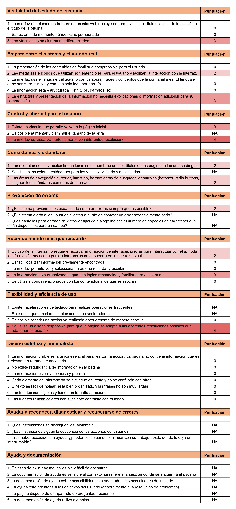

-----------------------------
## **Cambios a aplicar en próxima interación**

- Eliminar botón " + ".
- Estilo visual más parecido a PokémonGO.
- Juntar los tipos de búsqueda en una pantalla.
- Eliminar en botón de menú.
- Mobile first.
- Ver referentes de apps donde la búsqueda sea parte importante. 
- Si hay logo, que este lleve al inicio.
- Sugerencias de Pokémon a medida que se vaya escribiendo el nombre para evitar errores.
- Barra de navegación que indique donde estás en todo momento.

-----------------------------
-----------------------------

# **"DataGO" [EXTRA] Proyecto Data Lovers**
Como trabajo extra de el Proyecto Data Lovers, se iteró en todo el proceso de Diseño de experiencia de Usuario. Se tomaron en cuenta el listado de cambios que se definieron luego de los testeos de usabilidad y la Evaluación Heurística del prototipo 5.

## **Definición del Usuario**
-----------------------------
## **Encuestas**

Con más respuestas de la encuesta compartida, se volvió a hacer un análisis de los resultados, concluyendo lo siguiente sobre el usuario promedio:

- La edad promedio es de entre 20 y 35 años.
- Juega diariamente.
- Su nivel en el juego es de entre 30 - 40.
- Bien podria ser un hombre o una mujer.
- En el juego gusta de coleccionar Pokémones y combatir en gimnasios.
- Le motiva el subir de nivel y coleccionar a todos los Pokémon.

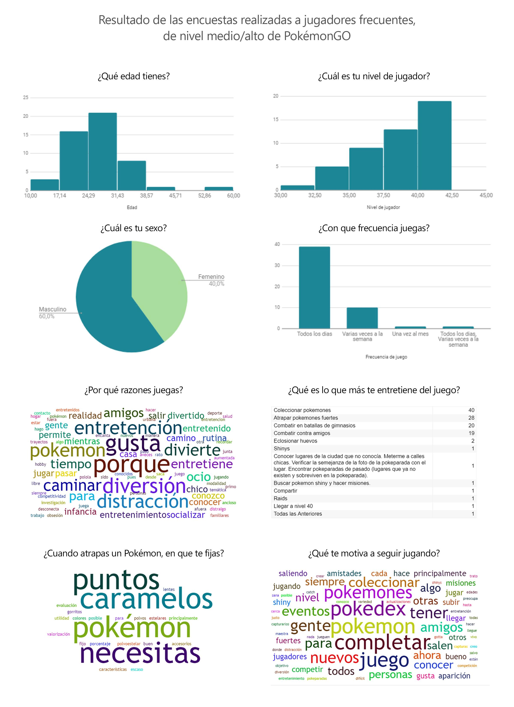

## **Usuario (User persona)**
Basandonos en los resultados de la encuesta y las conclusiones sobre el usuario promedio, se definió el siguiente User persona.

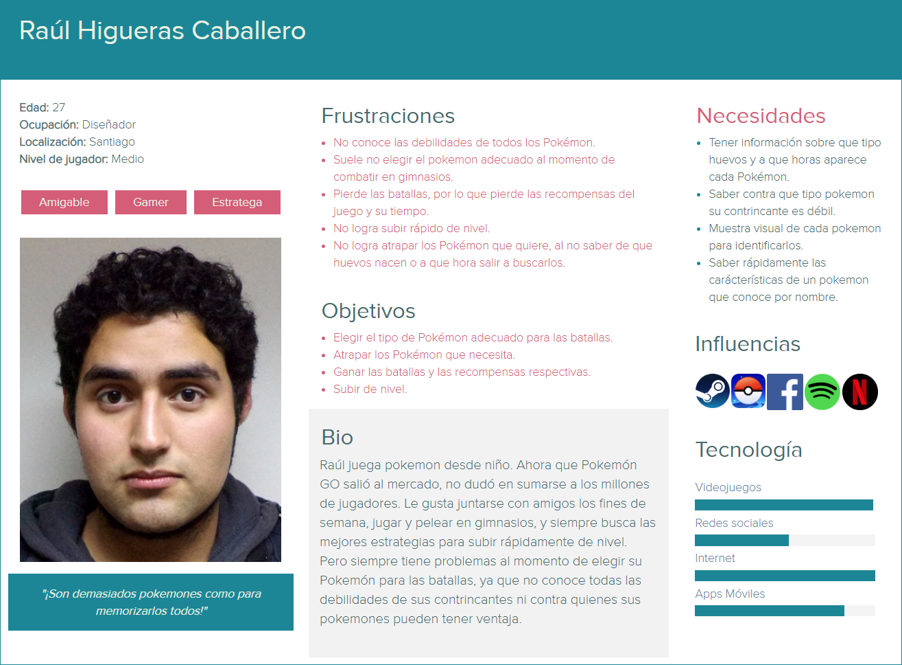

## **Historias de Usuario y Definition of Done**

Luego de haber definido nuestro Usuario y teniendo sus Necesidades, se trabajarán las siguientes historias de usuario con sus respectivos DoD, los cuales nos ayúdaran en nuestra planificación y desarrollo del prototipo:

**Historia de Usuario 1**

|         COMO   |QUIERO                         |PARA                         |
|----------------|-------------------------------|-----------------------------|
|Jugador regular de PokémonGO |` Un buscador` |Encontrar el Pokémon que busco y su información|

**Definition of Done**

Busqueda por nombre
- [x] Al presionar "Buscar" se verá este tipo de busqueda
- [x] Input para escribir nombre de Pokémon
- [x] Se abrira el teclado al hacer click en la barra de busqueda
- [x] Se verá un icono de carga al hacer click en la barra de busqueda (cuand aún no se haya escrito nada)
- [x] A medida que se escriba, se verán sugerencias de Pokémon coincidentes con la letra escrita
- [x] Hacer click en la imagen o nombre del pokemon sugerido para acceder al Pokémon buscado
- [x] Se mostrará el Pokémon buscado
- [x] Botón de volver a inicio
- [x] Botón de volver a pantalla anterior

Filtrar (ver pasos para filtrar en la otra historia de usuario)
- [x] Se mostrarán los Pokémon ordenados por tipo
- [x] Botón de volver a inicio
- [x] Botón de volver a pantalla anterior

Ordenar
- [x] Al presionar "Buscar" se verá este tipo de busqueda
- [x] Botones de ordenado por nombre y por número de la  Pokédex
- [x] Título referente al orden seleccionado
- [x] Se Mostrarán los Pokémon ordenados segun orden seleccionado
- [x] Botón de volver a inicio
- [x] Botón de volver a pantalla anterior

Despues de encontrar el Pokémon buscado
- [x] Al clickear sobre cada Pokémon se abriran mostrará más info
- [x] Mostrar info más detallada de cada Pokémon: Tipo de caramelo, Tipo de Huevo, hora de aparición.

**Historia de Usuario 1**

|         COMO   |QUIERO                         |PARA                         |
|----------------|-------------------------------|-----------------------------|
|Jugador regular de PokémonGO |` Ver Pokémon por tipo` |Encontrar rapidamente a mi contrincante y sus debilidades|

**Definition of Done**

Filtrar por tipo
- [x] Dentro de "Buscar" agregar filtrado
- [x] Botones de filtro por tipo. Cada uno con el color representativo del tipo
- [x] Mostrar todos los Pokémon del tipo seleccionado
- [x] Título referente al tipo seleccionado
- [x] Tip sobre el tipo de Pokémon seleccionado
- [x] Al clickear sobre cada Pokémon se mostrará más info
- [x] Mostrar el tipo con nombre de cada Pokémon en su info detallada
- [x] Debilidades de cada Pokémon es su info detallada
- [x] Botón de volver al inicio
- [x] Botón de volver a "Buscar"
-----------------------------

## **Planificación**

> La planificación de este Sprint está en el siguiente link de [Trello](https://trello.com/b/sJT2pxSd/extraux).

-----------------------------

# **Iteración del producto**

## **Mapa de flujo**

Al tener los Definition of Done, o requerimientos de la plataforma, se trabajó un mapa de flujo, para guiarnos en la usabilidad.

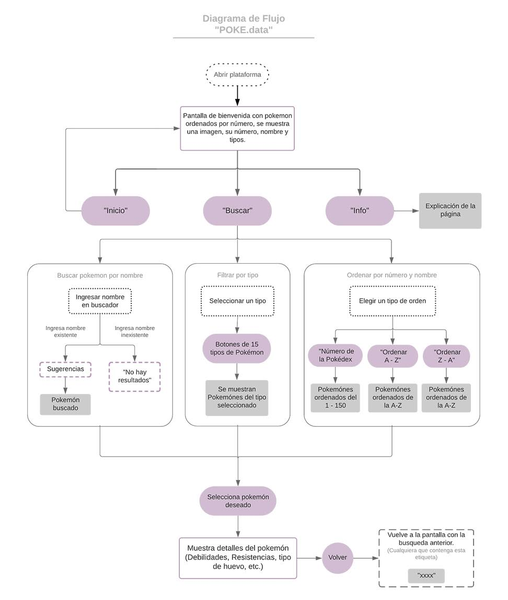

## **Referente visual y de Usabilidad**

Luego de múltiples análisis tipológicos, se seleccionó a la aplicación "Spotify" para ser el referente visual estrella. Su función de búsqueda de música, lo hace un potente referente por su usabilidad.

Elementos como el menú inferior estático, se mantienen también en otras aplicaciones.
Y un buscador de una sola pantalla, es la solución que se buscaba para esta iteración.

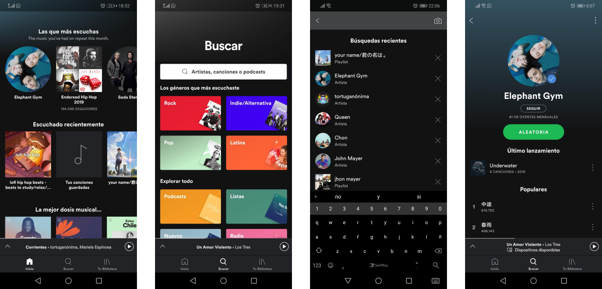

Tamién se tomó referencia directa de la aplicación original, para tomar un lenguaje que fuera familiar para el usuario.

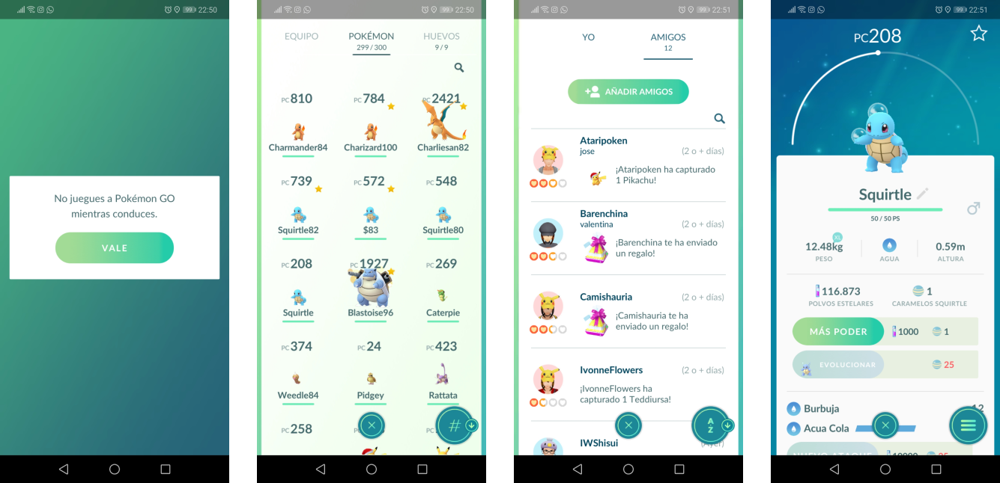

## **Prototipo de baja Fidelidad**

Teniendo ya los referentes, se procedió a generar los primeros sketches de la aplicación.

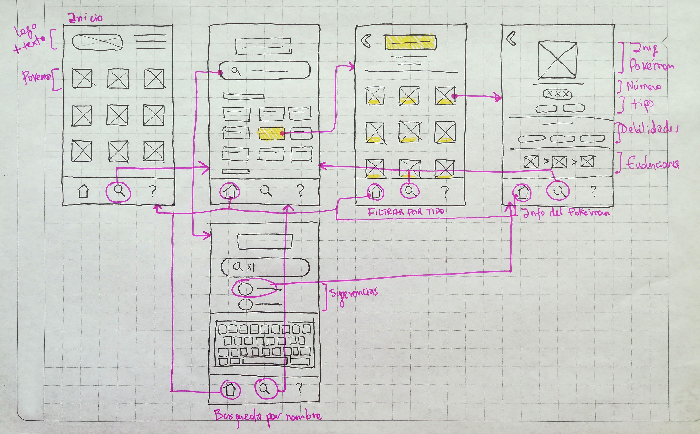

## **Prototipo de mediana Fidelidad**
Diagramación de los elementos, sin aplicación de colores.

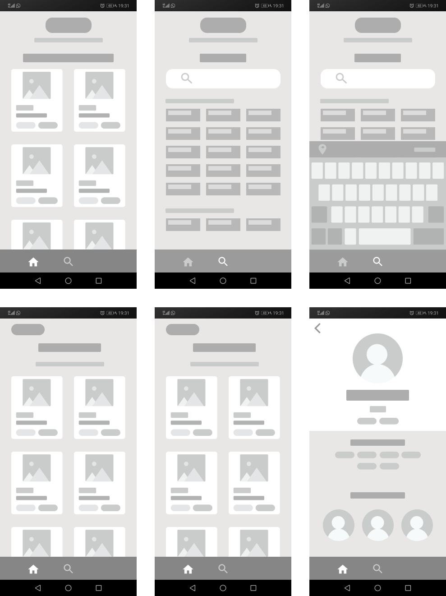

## **Desarrollo de Interfaz UI**
-----------------------------

Tomando los referentes antes mencionados, se realiza el Diseño de la Interfaz de alta calidad en la plataforma [Figma](https://www.figma.com/file/gM0bHkObok4wh8ztF5RmCN2F/MobilePrototipo-6?node-id=0%3A1).
(Interactiva)

## **Mobile First**
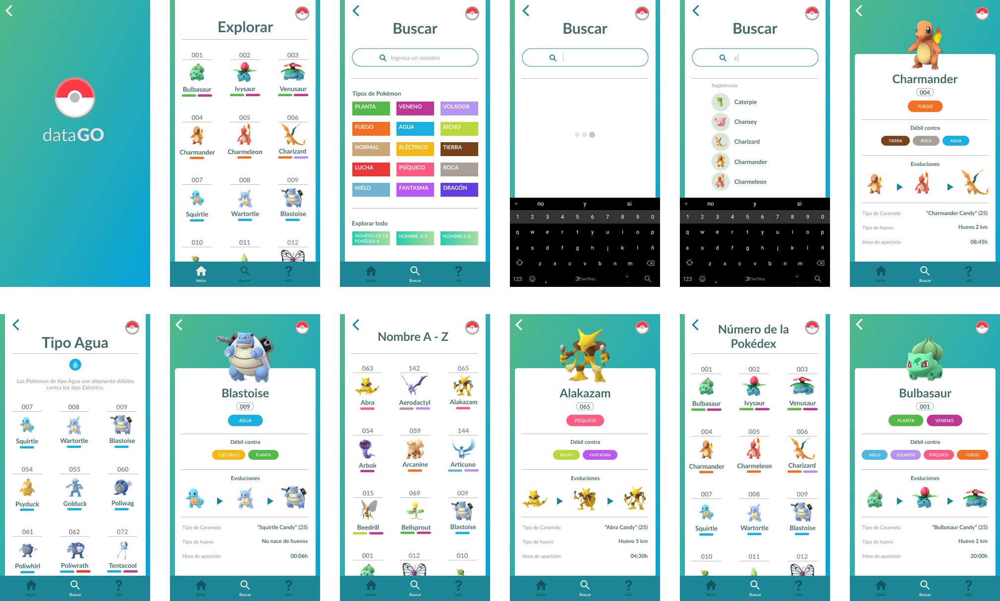

Menú estático, que indica en que parte de la aplicación estás. Además tiene los vínculos que lleva al inicio o a la pantalla de Busqueda.

Al presionar "Buscar" del menú estático, se muestra una pantalla con los 3 tipos de búsqueda juntos.
Cada pantalla lleva como título la función seleccionada, para indicar que se está realizando.

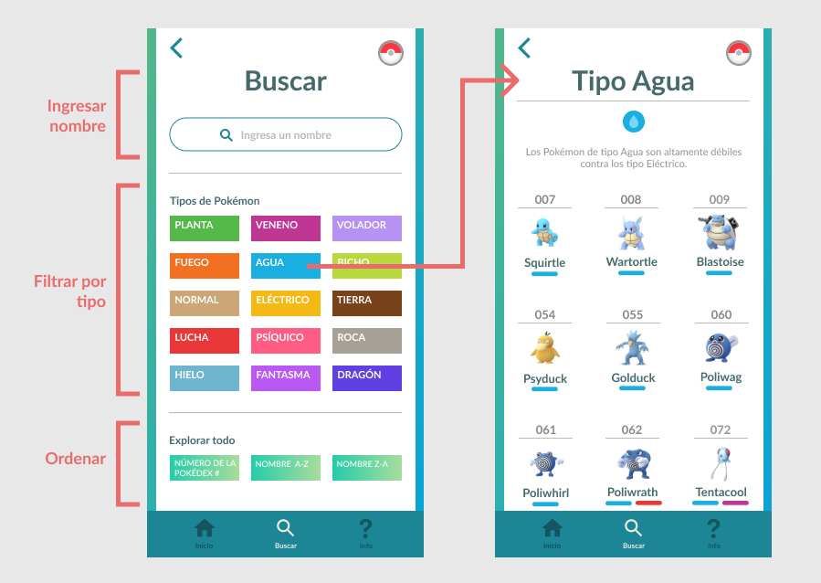

Al ingresar letras, se van mostrando sugerencias por cada letra ingresada. De esta forma ayudamos al usuario a buscar por nombre cuando no sabe el nombre exacto.

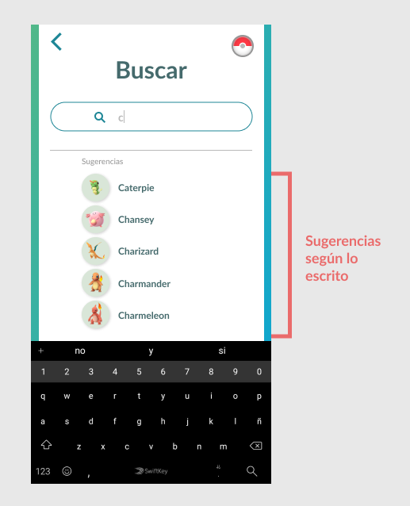

Se muestra solo con colores los tipos de cada Pokémon, para reducir elementos en la pantalla donde se muestran todos los Pokémon. Estos tipos se muestran en el detalle de cada Pokémon.

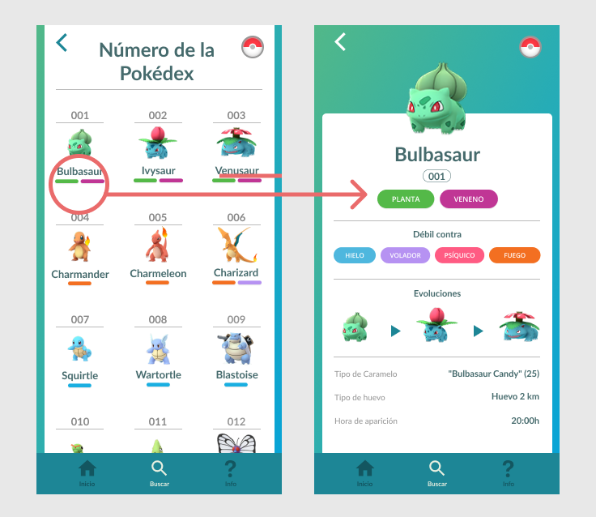

## **Flujo de usabilidad**

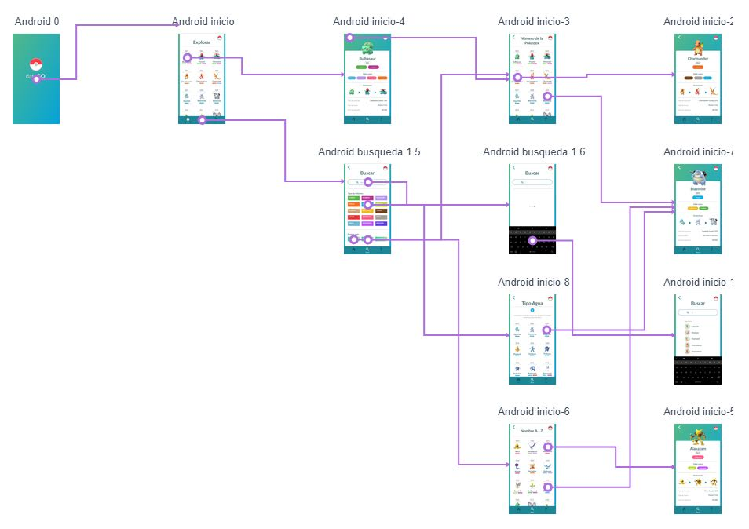

## **Evaluación Heurística**

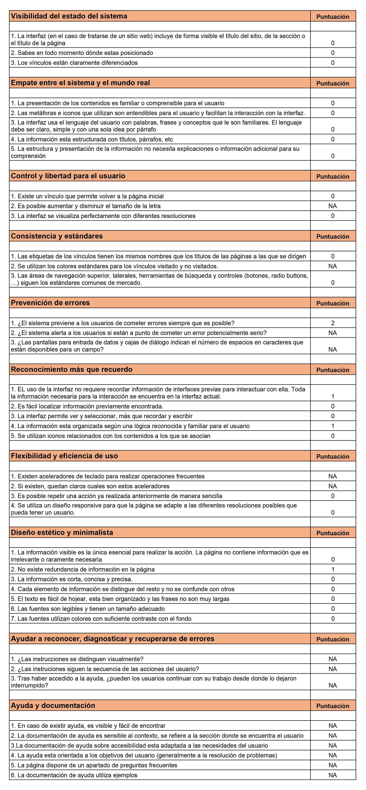

## **Prototipo Escritorio**

Tomando como referencia la versión Desktop de "Spotify" se traspasó el diseño para celular a su versión de [Escritorio](https://www.figma.com/file/KwhrGl5kGF1Gsyadfoi41QGj/WebPrototipo-6).

